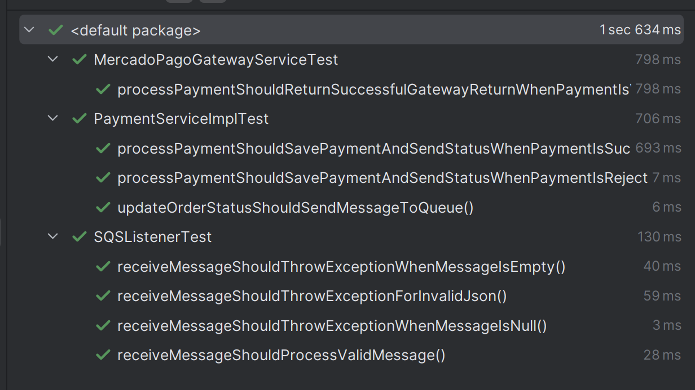

# mazyfood-payment

[](https://sonarcloud.io/summary/new_code?id=Food-Tech-Challenge_mazyfood-order)
[](https://sonarcloud.io/summary/new_code?id=Food-Tech-Challenge_mazyfood-order)
[](https://sonarcloud.io/summary/new_code?id=Food-Tech-Challenge_mazyfood-order)


Tech Challenge Fast Food desenvolvido no curso de Pós-Graduação em Arquitetura de Software na Pós-Tech FIAP.

---

## Sumário

1. [Sobre o Projeto](#sobre-o-projeto)
2. [Qualidade do código](#qualidade-do-código)
3. [Tecnologias Utilizadas](#tecnologias-utilizadas)
4. [Pré-requisitos](#pré-requisitos)
5. [Como Executar Localmente](#como-executar-localmente)
6. [Participantes](#participantes)

---

## Sobre o Projeto

O **MAZYFood Payment** é um microsserviço desenvolvido em **Spring Boot**, seguindo o padrão de **Layered Architecture**
.Além da API em Spring Boot, o projeto utiliza o banco de dados
**MongoDB** e filas **SQS**. Este projeto tem como objetivo oferecer uma base sólida para estudos e aplicação prática
de conceitos
avançados em arquitetura de software com foco em microsserviços.

---

## Qualidade do Código

### Testes unitários


### SonarQube


### Cobertura de Testes


---


## Tecnologias Utilizadas

- **Java** (Spring Boot): Framework para construção de aplicações robustas e escaláveis.
- **Docker**: Ferramenta de containerização para garantir a portabilidade e consistência do ambiente.
- **MongoDB**: Banco de dados NoSQL utilizado para persistência de dados.
- **SQS**: Serviço de fila da AWS utilizado para desacoplamento entre componentes da aplicação, garantindo comunicação
  assíncrona, escalabilidade e maior resiliência no processamento de mensagens.
- **Layered Architecture**: Padrão arquitetural utilizado em aplicações Spring Boot.
- **Helm**: Gerenciador de pacotes para Kubernetes.

---

## Pré-requisitos

Antes de começar, certifique-se de ter as seguintes ferramentas instaladas em seu ambiente:

- **Docker**: Para construir as imagens da aplicação.
- **Git**: Para clonar o repositório.
- **Kubectl**: Para gerenciar os recursos do cluster Kubernetes.
- **Helm**: Para gerenciar os pacotes Kubernetes.
- **Localstack**: Ambiente local que simula serviços da AWS, permitindo o desenvolvimento e testes de integrações com
  recursos como SQS, S3 e outros, sem necessidade de acesso à nuvem real.

---

## Como Executar Localmente

Siga os passos abaixo para configurar e executar o projeto em seu ambiente local:

1. **Clonar o repositório**
   ```bash
   git clone git@github.com:Food-Tech-Challenge/mazyfood-payment.git
   cd mazyfood-payment
   ```

2. **Rodar o banco de dados com Docker Compose**
   ```bash
   docker compose up
   ```

3. **Configurar e rodar a aplicação com Minikube**
    - **Iniciar o Minikube**:
      ```bash
      minikube start
      ```

    - **Habilitar o Minikube no Docker**:
      ```bash
      eval $(minikube docker-env)
      ```

    - **Habilitar o registro de imagens no Minikube**:
      ```bash
      minikube addons enable registry
      ```

    - **Construir e enviar a imagem para o registro do Minikube**:
      ```bash
      docker image build -t localhost:5000/mazyfood-payment:latest .
      docker image push localhost:5000/mazyfood-payment:latest
      ```

    - **Deploy com Helm**:
      ```bash
      helm upgrade --install mazyfood-payment helm/
      ```

4. **Obter o IP e porta do serviço**
    - **Encontrar o IP do Minikube**:
      ```bash
      minikube ip
      ```
    - **Encontrar a porta do NodePort do serviço**:
      ```bash
      kubectl get svc mazyfood-payment-service -o wide
      ```

---

## Participantes

- **Alison Israel - RM358367**  
  *Discord*: @taykarus | E-mail: taykarus@gmail.com

- **José Matheus de Oliveira - RM358854**  
  *Discord*: @jsmatheus | E-mail: matheusoliveira.info@gmail.com

- **Victor Zaniquelli - RM358533**  
  *Discord*: @zaniquelli | E-mail: zaniquelli@outlook.com.br

- **Yan Gianini - RM358368**  
  *Discord*: @.gianini | E-mail: yangianini@gmail.com
